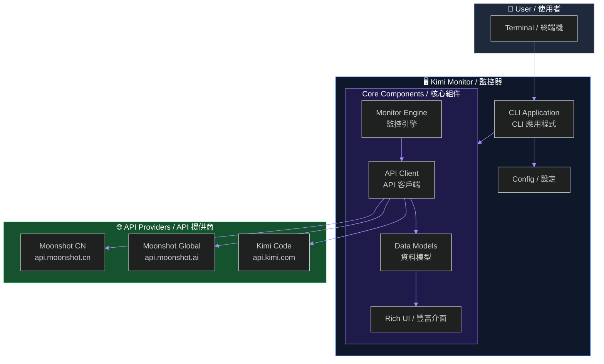
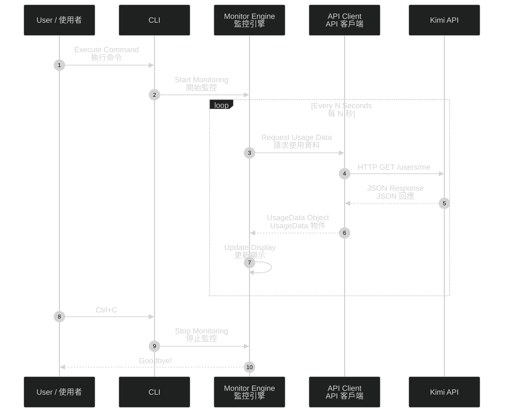
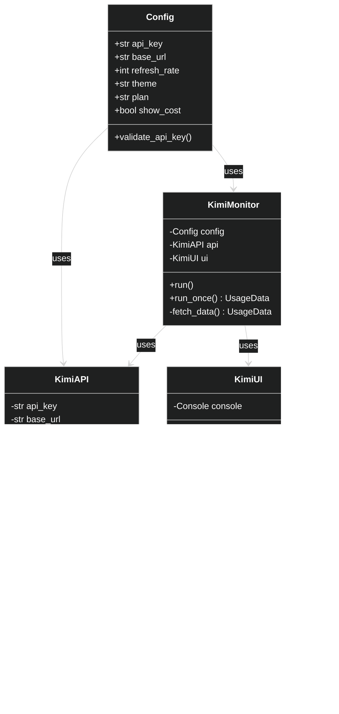
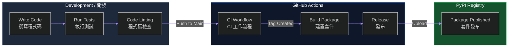
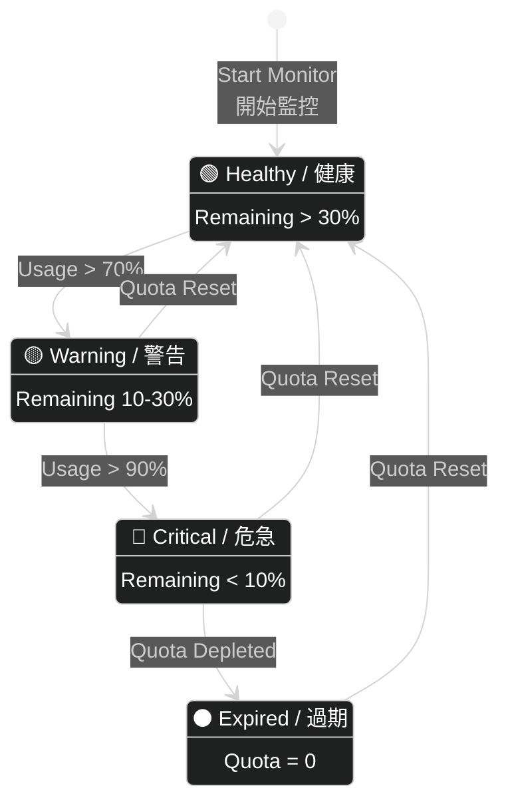
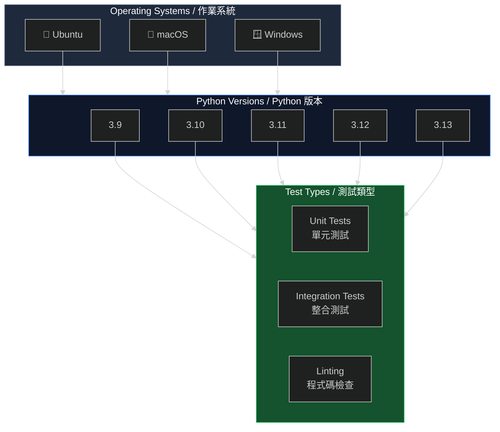
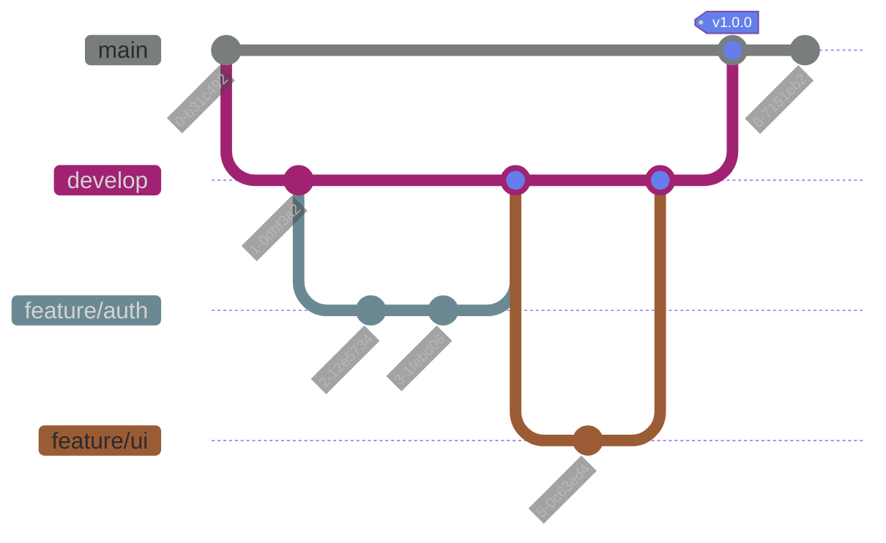
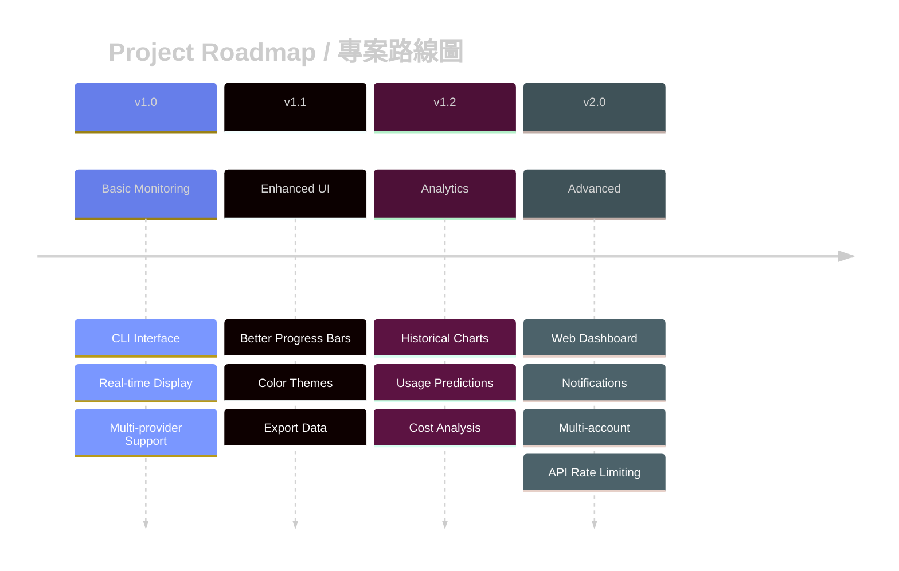

# 🌙 Kimi CLI Usage Monitor

<p align="center">
  <b>A beautiful real-time terminal monitoring tool for Kimi AI usage</b><br>
  <b>美麗的即時終端監控工具，用於監控 Kimi AI 使用量</b>
</p>

---

## 🎯 API Support / API 支援狀況

> ⚠️ **Please read this carefully before using!**
> ⚠️ **使用前請仔細閱讀！**

### ✅ Supported / 支援

| API / 接口 | Endpoint | Usage Query / 使用量查詢 | Note |
|-----------|----------|-------------------------|------|
| **Moonshot API** | `api.moonshot.cn` | ✅ **YES** | Requires `MOONSHOT_API_KEY` / 需要 `MOONSHOT_API_KEY` |
| **Moonshot Global** | `api.moonshot.ai` | ✅ **YES** | International endpoint / 國際端點 |

### ❌ Not Supported / 不支援

| API / 接口 | Endpoint | Usage Query / 使用量查詢 | Note |
|-----------|----------|-------------------------|------|
| **Kimi Code API** | `api.kimi.com/coding/v1` | ❌ **NO** | OAuth token from `kimi-cli` cannot access usage endpoints / `kimi-cli` 的 OAuth token 無法存取使用量端點 |

### Quick Check / 快速檢查

```bash
# If you use kimi-cli OAuth / 如果使用 kimi-cli OAuth
kimi-monitor
# → Will show "Kimi Code API does not support usage queries"

# If you use Moonshot API Key / 如果使用 Moonshot API Key
export MOONSHOT_API_KEY="sk-..."
kimi-monitor
# → Will show usage statistics ✓
```

---

<p align="center">
  <a href="https://github.com/tboydar/kimi-usage-monitor">
    
  </a>
  <a href="https://github.com/tboydar/kimi-usage-monitor/blob/main/LICENSE">
    
  </a>
  <a href="https://github.com/psf/black">
    
  </a>
</p>

---

## 📸 Screenshot / 截圖

```
🌙 Kimi Usage Monitor
══════════════════════════════════════════════════
Last updated: 2024-03-16 15:30:00
══════════════════════════════════════════════════

Token Usage
━━━━━━━━━━━━━━━━━━━━━━━━━━━━━━━━━━━━━━━━━━  24.0%
                                            3.8M remaining

📊 Usage Statistics
Metric          Value         Percentage
─────────────────────────────────────────
Total Quota     5.0M          100%
Used            1.2M          24.0%
Remaining       3.8M          76.0%
Today's Usage   125K
This Week       890K
Total Cost      $0.50

📋 Plan Information
┌─────────────────────────────────────┐
│ Plan: PRO                           │
│ Expires: 2024-04-15 (30 days left)  │
│ Reset: Daily                        │
└─────────────────────────────────────┘

══════════════════════════════════════════════════
Press Ctrl+C to exit | Auto-refresh: 10s
══════════════════════════════════════════════════
```

---

## ✨ Features / 功能特色

| English | 中文 |
|---------|------|
| 🔄 **Real-time Monitoring** - Live token usage tracking with beautiful progress bars | 🔄 **即時監控** - 即時 Token 使用量追蹤，附帶美觀進度條 |
| 📊 **Rich UI** - Beautiful tables, panels, and visualizations | 📊 **豐富 UI** - 美觀的表格、面板和視覺化 |
| 🎨 **Multi Themes** - Auto, Light, Dark, Classic | 🎨 **多主題** - 自動、亮色、暗色、經典 |
| 🌍 **Multi-Provider** - Moonshot CN/Global, Kimi Code | 🌍 **多提供商** - Moonshot 中國/全球、Kimi Code |
| ⏰ **Expiration Alerts** - Track plan expiry and days remaining | ⏰ **到期提醒** - 追蹤方案到期日和剩餘天數 |
| 💰 **Cost Tracking** - Monitor your API spending | 💰 **成本追蹤** - 監控 API 支出 |

---

## ⚠️ Important Note / 重要說明

### Kimi Code API Limitation / Kimi Code API 限制

**Kimi CLI Usage Monitor** uses OAuth authentication from `kimi-cli`, which connects to the **Kimi Code API** (`api.kimi.com/coding/v1`).

**Kimi CLI Usage Monitor** 使用 `kimi-cli` 的 OAuth 認證，連接到 **Kimi Code API** (`api.kimi.com/coding/v1`)。

> ⚠️ **Kimi Code API does NOT provide usage/balance endpoints.**  
> ⚠️ **Kimi Code API 不提供使用量/餘額查詢端點。**

This is a limitation of the Kimi Code platform, not this tool. OAuth tokens cannot access usage data.

這是 Kimi Code 平台的限制，不是本工具的問題。OAuth token 無法存取使用量資料。

### To View Your Usage / 查看使用量方式

| Method / 方式 | URL | Description |
|--------------|-----|-------------|
| Web Console / 網頁控制台 | https://platform.moonshot.cn/console/account | View balance & usage / 查看餘額與使用 |
| API Key / API 金鑰 | Set `MOONSHOT_API_KEY` | Use Moonshot API directly / 直接使用 Moonshot API |

---

## 🚀 Installation / 安裝

### Using pip / 使用 pip

```bash
pip install kimi-monitor
```

### Using uv (Modern Python) / 使用 uv (現代 Python)

```bash
# Install uv first / 先安裝 uv
curl -LsSf https://astral.sh/uv/install.sh | sh

# Install with uv / 使用 uv 安裝
uv tool install kimi-monitor
```

### From Source / 從原始碼安裝

```bash
git clone https://github.com/tboydar/kimi-usage-monitor.git
cd kimi-usage-monitor
pip install -e .
```

---

## 📖 Quick Start / 快速開始

### 1. Set API Key / 設定 API 金鑰

```bash
# Get your API key from / 從以下網站取得 API Key:
# https://platform.moonshot.cn (Moonshot)
# https://www.kimi.com/code (Kimi Code)

export KIMI_API_KEY="sk-..."
```

### 2. Run Monitor / 執行監控

```bash
# Start real-time monitoring / 開始即時監控
kimi-monitor

# Or use short alias / 或使用短別名
km
```

---

## 📚 Usage / 使用方式

### Command Aliases / 命令別名

```bash
kimi-monitor      # Full command / 完整命令
kimi-usage        # Alternative / 替代命令
km                # Shortest alias / 最短別名
```

### Basic Options / 基本選項

```bash
# Use specific plan / 使用特定方案
kimi-monitor --plan max5

# Dark theme / 暗色主題
kimi-monitor --theme dark

# Faster refresh (5 seconds) / 更快重新整理 (5秒)
kimi-monitor --refresh-rate 5

# Run once and exit / 執行一次後退出
kimi-monitor --once

# Use Kimi Code API / 使用 Kimi Code API
kimi-monitor --provider kimicode
```

### Available Plans / 可用方案

| Plan | Description (EN) | 說明 (中文) |
|------|------------------|-------------|
| `free` | Free tier | 免費方案 |
| `pro` | Pro subscription | 專業版訂閱 |
| `max5` | Max5 subscription | Max5 訂閱 |
| `max20` | Max20 subscription | Max20 訂閱 |
| `custom` | Custom limits | 自訂限制 |

### Provider Options / 提供商選項

| Provider | Endpoint | Description |
|----------|----------|-------------|
| `moonshot` | https://api.moonshot.cn/v1 | China endpoint / 中國端點 |
| `moonshot-global` | https://api.moonshot.ai/v1 | Global endpoint / 全球端點 |
| `kimicode` | https://api.kimi.com/coding/v1 | Kimi Code endpoint |

---

## 🎨 Themes / 主題

```bash
# Auto-detect (default) / 自動偵測 (預設)
kimi-monitor --theme auto

# Light theme / 亮色主題
kimi-monitor --theme light

# Dark theme / 暗色主題
kimi-monitor --theme dark

# Classic terminal colors / 經典終端顏色
kimi-monitor --theme classic
```

---

## 🛠️ Development / 開發

### Setup Development Environment / 設定開發環境

```bash
git clone https://github.com/tboydar/kimi-usage-monitor.git
cd kimi-usage-monitor
python -m venv venv
source venv/bin/activate  # Windows: venv\Scripts\activate
pip install -e ".[dev]"
```

### Run Tests / 執行測試

```bash
pytest
```

### Code Formatting / 程式碼格式化

```bash
black src/
ruff check src/
```

---

## 🏗️ Architecture / 架構

### System Architecture / 系統架構



### Data Flow / 資料流



### Class Diagram / 類別圖



---

## 📁 Project Structure / 專案結構

```
kimi-usage-monitor/
├── src/kimi_monitor/         # Main package / 主程式包
│   ├── cli.py               # CLI entry / CLI 入口
│   ├── models.py            # Data models / 資料模型
│   ├── api.py               # API client / API 客戶端
│   ├── ui.py                # Rich UI / 豐富 UI
│   └── monitor.py           # Monitor engine / 監控引擎
├── tests/                    # Tests / 測試
├── pyproject.toml           # Project config / 專案設定
└── README.md                # This file / 本文件
```

---

## 🔄 CI/CD Pipeline / 持續整合與部署



---

## 🎯 Usage Status Flow / 使用狀態流程



---

## 🧪 Test Matrix / 測試矩陣



---

## 🤝 Contributing / 貢獻

Contributions are welcome! Please feel free to submit a Pull Request.

歡迎貢獻！請隨時提交 Pull Request。

1. Fork the repository / Fork 倉庫
2. Create your feature branch / 建立功能分支 (`git checkout -b feature/amazing-feature`)
3. Commit your changes / 提交變更 (`git commit -m 'Add amazing feature'`)
4. Push to the branch / 推送到分支 (`git push origin feature/amazing-feature`)
5. Open a Pull Request / 開啟 Pull Request

### Git Workflow / Git 工作流程



---

## 📄 License / 授權

This project is licensed under the MIT License.

本專案採用 MIT 授權。

See [LICENSE](LICENSE) file for details.

---

## 📅 Roadmap / 路線圖



### Feature Matrix / 功能矩陣

```mermaid
%%{init: {'theme': 'dark', 'themeVariables': { 'primaryColor': '#22c55e', 'primaryTextColor': '#fff', 'primaryBorderColor': '#16a34a'}}}%%
graph LR
    subgraph Core["✅ Core Features / 核心功能"]
        direction TB
        F1[Real-time Monitoring]
        F2[Multi-provider Support]
        F3[Rich UI]
        F4[Bilingual Support]
    end
    
    subgraph Planned["🚧 Planned / 計畫中"]
        direction TB
        P1[Web Dashboard]
        P2[Usage Predictions]
        P3[Mobile App]
        P4[Slack Integration]
    end
    
    subgraph Ideas["💡 Ideas / 想法"]
        direction TB
        I1[AI Insights]
        I2[Team Collaboration]
        I3[Custom Alerts]
    end
    
    Core --> Planned --> Ideas
    
    style Core fill:#14532d,stroke:#22c55e,color:#fff
    style Planned fill:#713f12,stroke:#eab308,color:#fff
    style Ideas fill:#1e293b,stroke:#64748b,color:#fff
```



---

## 🙏 Acknowledgments / 致謝

- Inspired by [Claude-Code-Usage-Monitor](https://github.com/Maciek-roboblog/Claude-Code-Usage-Monitor)
- Built with [Rich](https://github.com/Textualize/rich) for beautiful terminal UI
- Uses [Click](https://github.com/pallets/click) for CLI interface

---

## 🔗 Links / 連結

- [Kimi Platform](https://platform.moonshot.cn)
- [Kimi Code](https://www.kimi.com/code)
- [API Documentation](https://platform.moonshot.cn/docs)

---

<p align="center">
  Made with ❤️ for the Kimi AI community<br>
  為 Kimi AI 社群用心製作
</p>
